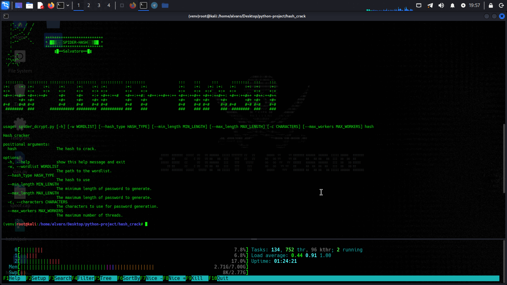

### ScorpioList

[]()
[]()

This program will decrypt capture handshake or  [sha,sha224,sha256,sha512,md5...etc]

### NOTICE

~~I'm no longer maintaining this project scorpion .~~

### Support                                                  

Hello, I am (The Scorpion), and I present to you the most powerful password-cracking collection. I personally compiled this wordlist from sources all over the world; it covers WPA, WPA2, WPS, WEP, and WPA3 protocols. This collection consists of a "magic mix" I prepared myself, boasting a 60% success rate. I have personally used it to successfully compromise over 20 different routers.
subscribe my channel

```                                                                 
https://youtu.be/Nx0FqqmzZLI

```                                                                       
  
# Installing

* ```git clone https://github.com/blackmask00/scorpiolist.git```
* ```cd scopiolist.```
* ```hashcat -m 22000 hash.hc22000 scorpiolis.txt```


# help

```
usage: 

this is powerfull wordlist for crack any password 

this for handshake cracking 

aircrack-ng hand.cap scorpiolist.txt

jhon & medus is working 

this for cracking any hash 
```

# Example :


*``` python spider_dcrypt.py 6fcea714d9e78f6aebeb89a755797952c4bac913 --min_length 4 --max_length 8 -w wordlist.txt --hash_type sha1```

This script is a hashlib application that performs a Mass Attack hash o>
The tool is intended to automate brutforce hash profiles by sending HTT>

### script image


## Social media

```
https://youtube.com/@cyber-security_morocco_00
```
